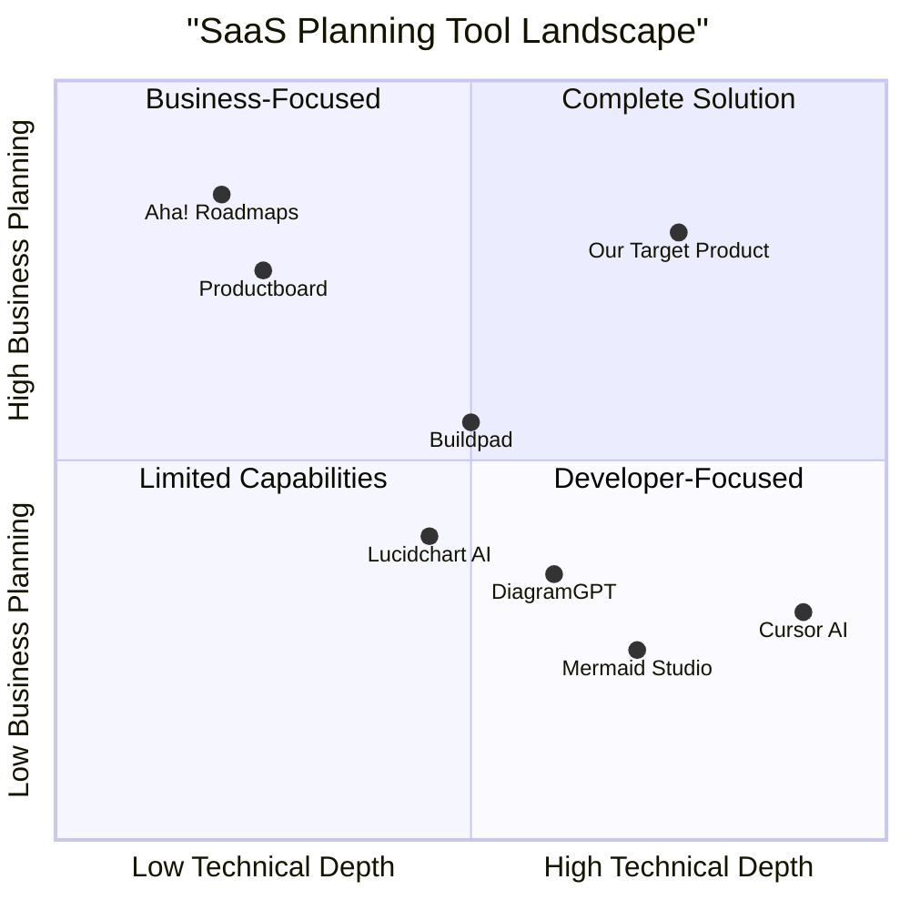

# Product Requirements Document (PRD)

## SaaS Blueprint Generator Platform

**Date:** June 1, 2025  
**Version:** 1.0  
**Author:** Emma, Product Manager

---

## Table of Contents
1. [Introduction](#1-introduction)
2. [Product Definition](#2-product-definition)
3. [Technical Specifications](#3-technical-specifications)
4. [User Interface](#4-user-interface)
5. [Features and Requirements](#5-features-and-requirements)
6. [Implementation Considerations](#6-implementation-considerations)
7. [Open Questions](#7-open-questions)

---

## 1. Introduction

### 1.1 Purpose
This document outlines the requirements for the SaaS Blueprint Generator Platform, an advanced MVP that transforms SaaS ideas into comprehensive visual blueprints and implementation plans.

### 1.2 Scope
The SaaS Blueprint Generator Platform is designed to help entrepreneurs, product managers, and development teams quickly validate SaaS ideas and create structured plans for implementation. The platform leverages AI to provide idea validation, feature recommendations, tech stack suggestions, user flow diagrams, and project management tools.

### 1.3 Product Overview
Users input their SaaS idea and description into the platform and receive an AI-generated visual blueprint that provides guidance for developing their website or application. The platform validates the idea, suggests improvements, defines core features, recommends appropriate technology stacks, generates user flow diagrams, creates Kanban cards for task management, and offers a project overview with progress tracking. Additionally, it integrates an AI agent (MCP, powered by Cursor AI) to automate ticket management and assist with code generation.

### 1.4 Original Requirements
A SaaS platform that allows users to input their SaaS idea and description, receiving an AI-generated visual blueprint to guide the development of their website or app. The platform validates the idea, provides improvement suggestions, defines core features, recommends a tech stack, generates a user flow diagram, creates Kanban cards for task management, and offers a project overview with progress tracking. It integrates an AI agent (MCP, powered by Cursor AI) to automate ticket management and code the application.

---

## 2. Product Definition

### 2.1 Product Goals
1. **Accelerate SaaS Development**: Reduce the time from idea conceptualization to structured development plan by 80%
2. **Improve Project Success Rates**: Increase the success rate of SaaS projects by providing comprehensive, AI-validated blueprints based on market data and best practices
3. **Democratize Technical Planning**: Make professional-level SaaS planning accessible to entrepreneurs without deep technical expertise or extensive resources

### 2.2 User Stories

1. **As a non-technical founder**, I want to transform my SaaS idea into a comprehensive technical blueprint so that I can effectively communicate my vision to developers and investors.

2. **As a product manager**, I want to quickly validate SaaS concepts and generate feature specifications so that I can present structured plans to my team and stakeholders.

3. **As a technical founder**, I want AI-generated architecture recommendations and user flow diagrams so that I can accelerate my development process with industry best practices.

4. **As a startup team**, we want automated task creation and project management tools so that we can immediately begin implementing our SaaS blueprint with clear priorities and assignments.

5. **As a SaaS entrepreneur**, I want market validation and competitive analysis for my idea so that I can identify unique selling points and potential pitfalls before investing significant resources.

### 2.3 Competitive Analysis

| Product | Pros | Cons |
|---|---|---|
| **Productboard** | Strong customer feedback integration; Excellent roadmap visualization | Limited technical planning; No idea validation; Expensive |
| **Aha! Roadmaps** | Strategic planning with business alignment; Comprehensive feature set | Steep learning curve; No idea validation; No tech stack recommendations |
| **Buildpad** | 7-phase roadmap structure; Project management capabilities | Limited AI integration; No user flow generation; Basic visualization |
| **Cursor AI** | Powerful code generation; AI pair programming | No project planning; No idea validation; Developer-focused |
| **Lucidchart AI** | Strong diagram generation; Collaboration features | Limited to diagrams; No idea validation; No project management |
| **DiagramGPT** | Natural language processing for diagrams; Easy to use | Limited to diagrams; No integration with project tools; No idea validation |
| **Our Target Product** | All-in-one solution from idea to implementation; AI-powered validation and recommendations; Integrated project management | New platform; Building trust in AI recommendations; Limited historical data |

### 2.4 Competitive Quadrant Chart

---

## 3. Technical Specifications

### 3.1 Requirements Analysis

The SaaS Blueprint Generator Platform needs to combine several AI capabilities to deliver a comprehensive solution:

1. **Natural Language Processing (NLP)**: To interpret user inputs about their SaaS idea and extract key information
2. **Market Intelligence**: To validate ideas against existing solutions and market trends
3. **Technical Knowledge Base**: To recommend appropriate technology stacks based on project requirements
4. **Diagram Generation**: To create user flows, architecture diagrams, and other visual representations
5. **Project Management Integration**: To translate blueprints into actionable tasks and project structures
6. **Code Generation**: To assist with implementation through the MCP AI agent
7. **User Interface**: To provide an intuitive experience for inputting ideas and viewing generated blueprints
8. **Data Storage**: To save user projects, blueprints, and implementation progress

### 3.2 Requirements Pool

#### P0 (Must-Have)

1. **Idea Input and Processing**
   - Web form for SaaS idea description and target market
   - AI processing to extract key product elements and objectives
   - Initial classification of the SaaS idea by category and complexity

2. **Idea Validation**
   - Market potential assessment
   - Identification of similar existing products
   - Analysis of differentiation opportunities
   - Risk assessment

3. **Core Feature Definition**
   - AI-generated list of essential features for MVP
   - Prioritization of features (must-have vs. nice-to-have)
   - User persona generation based on the product concept

4. **Tech Stack Recommendation**
   - Suggestion of appropriate front-end, back-end, and database technologies
   - Consideration of scalability requirements
   - Infrastructure recommendations (cloud services, etc.)

5. **User Flow Diagram Generation**
   - Visual representation of key user journeys
   - Interactive diagram with editable components
   - Exportable diagram formats (PNG, SVG, etc.)

6. **Kanban Task Creation**
   - Generation of development tasks based on features
   - Task categorization and prioritization
   - Exportable to common project management tools

7. **Project Overview Dashboard**
   - Summary visualization of the blueprint
   - Progress tracking capabilities
   - Key metrics and timeline estimates

8. **User Account System**
   - Registration and login functionality
   - Project saving and retrieval
   - Basic user profile management

#### P1 (Should-Have)

1. **MCP AI Agent Integration**
   - Connection to Cursor AI for code generation
   - Automated ticket management
   - Code snippets for key components

2. **Blueprint Iteration**
   - Ability to refine and update blueprints
   - Version history of blueprint changes
   - Comparison between versions

3. **Enhanced Visualization**
   - Technical architecture diagrams
   - Database schema visualization
   - API endpoint mapping

4. **Detailed Cost Estimation**
   - Development cost ranges
   - Infrastructure cost projections
   - Ongoing maintenance estimates

5. **Team Collaboration**
   - Sharing capabilities with role-based access
   - Commenting and feedback functionality
   - Real-time collaborative editing

#### P2 (Nice-to-Have)

1. **Funding Guidance**
   - Bootstrap vs. funding recommendations
   - Pitch deck template generation
   - Investor targeting suggestions

2. **Team Builder**
   - Skill sets needed for implementation
   - Role definition and hiring recommendations
   - Resource allocation suggestions

3. **Marketplace Integration**
   - Connection to freelancers/agencies for implementation
   - Template marketplace for common SaaS components

4. **Learning Resources**
   - Customized learning path for founders
   - Integration with tutorials specific to recommended tech stack

5. **AI-Powered Analytics**
   - Market trend analysis for the specific SaaS category
   - Competitive intelligence updates
   - Success probability modeling

### 3.3 UI Design Draft

The user interface will follow a guided, step-by-step approach with a modern, clean design:

1. **Idea Input Screen**
   - Conversational interface with guiding prompts
   - Text areas for detailed descriptions
   - Multiple-choice questions for key parameters
   - Progress indicator showing completion status

2. **Blueprint Dashboard**
   - Central hub displaying all generated components
   - Card-based layout for different blueprint sections
   - Interactive visualization of key diagrams
   - Navigation sidebar for quick access to sections

3. **Detailed Views**
   - Expandable sections for each blueprint component
   - Edit options for user modifications
   - Version history accessible from each component
   - Export buttons for individual components

4. **Project Management View**
   - Kanban board visualization
   - Task detail panels
   - Progress tracking charts
   - Team assignment interface

5. **Settings and Configuration**
   - User profile management
   - Notification preferences
   - Integration settings for external tools
   - Subscription management

### 3.4 Open Questions

1. **AI Model Selection**: What specific AI models should be used for different components (NLP, diagram generation, code generation)?

2. **Integration Depth**: How deeply should the platform integrate with external tools (Cursor AI, project management systems) vs. building native functionality?

3. **Validation Metrics**: What specific data sources and metrics should be used to validate SaaS ideas effectively?

4. **Pricing Strategy**: What pricing model will best align with the value proposition while ensuring accessibility for startups?

5. **Technical Limitations**: What are the boundaries of accurate tech stack recommendations without human expert input?

---

## 4. User Interface

### 4.1 User Flow

The platform will guide users through a sequential process:

1. **Account Creation/Login**
   - Email/password or social login options
   - Optional onboarding tutorial

2. **Project Creation**
   - Project naming and basic categorization
   - Team member invitation (optional)

3. **Idea Input**
   - Guided form with sections for:
     * SaaS concept description
     * Target audience/market
     * Primary problems solved
     * Desired features and capabilities
     * Any technical preferences or constraints

4. **AI Processing**
   - Visual indication of processing status
   - Progress through different analysis stages

5. **Blueprint Review**
   - Complete blueprint dashboard
   - Option to navigate to specific sections

6. **Component Customization**
   - Ability to edit and refine individual components
   - Regeneration options for specific sections

7. **Project Management Setup**
   - Task review and customization
   - Team assignment (if applicable)
   - Timeline adjustment

8. **Implementation**
   - Progress tracking
   - MCP AI agent assistance
   - Code generation and management

### 4.2 Design Guidelines

- **Visual Language**: Clean, minimalist interface with sufficient white space
- **Color Scheme**: Professional palette with primary brand color, complementary accents, and neutral backgrounds
- **Typography**: Sans-serif fonts for readability across devices
- **Responsive Design**: Full functionality across desktop, tablet, and mobile devices
- **Loading States**: Clear visual indicators for AI processing with estimated completion times
- **Error Handling**: Helpful error messages with suggested actions
- **Accessibility**: WCAG 2.1 AA compliance for inclusive design

---

## 5. Features and Requirements

### 5.1 Idea Input and Validation

- **Must** provide a guided form with specific questions to extract comprehensive SaaS idea information
- **Must** analyze the idea for market viability using current market data
- **Must** identify similar existing products and analyze differentiation potential
- **Must** provide a confidence score for the idea's market potential
- **Must** suggest potential improvements or pivots if the idea shows weaknesses
- **Should** offer industry-specific guidance based on the SaaS category
- **May** provide trend analysis for the specific market segment

### 5.2 Feature Definition and Prioritization

- **Must** generate a comprehensive list of features for the proposed SaaS
- **Must** categorize features as MVP (core), growth phase, and future enhancements
- **Must** provide rationale for feature prioritization
- **Must** align features with identified user personas
- **Should** estimate development complexity for each feature
- **Should** identify potential technical challenges for complex features
- **May** suggest feature alternatives that could reduce development complexity

### 5.3 Tech Stack Recommendation

- **Must** recommend front-end technologies appropriate for the SaaS concept
- **Must** recommend back-end and database technologies appropriate for the requirements
- **Must** suggest cloud infrastructure and third-party services where applicable
- **Must** provide rationale for each technology recommendation
- **Should** consider scalability requirements in recommendations
- **Should** identify potential integration challenges between recommended technologies
- **May** offer alternative tech stacks with different trade-offs

### 5.4 Diagram Generation

- **Must** create user flow diagrams for primary user journeys
- **Must** generate diagrams in an editable format
- **Must** support exporting diagrams in common formats (PNG, SVG, PDF)
- **Should** create system architecture diagrams showing key components
- **Should** generate database schema visualizations
- **Should** provide API endpoint mapping when applicable
- **May** create additional specialized diagrams based on the SaaS category

### 5.5 Project Management

- **Must** generate a Kanban board with tasks derived from the blueprint
- **Must** prioritize tasks in a logical implementation sequence
- **Must** provide effort estimates for each task
- **Must** support task export to common project management tools
- **Should** allow task customization and reorganization
- **Should** support team member assignment to tasks
- **May** suggest sprint planning based on team size and availability

### 5.6 MCP AI Agent Integration

- **Must** connect with Cursor AI for code assistance
- **Must** provide code snippets for key components based on tech stack
- **Should** automate ticket management within the platform
- **Should** offer continuous coding assistance throughout implementation
- **May** provide automated code reviews and optimization suggestions

### 5.7 Project Overview and Progress Tracking

- **Must** provide a dashboard summarizing all blueprint components
- **Must** display project progress against the blueprint
- **Must** highlight potential bottlenecks or issues
- **Should** provide timeline projections based on progress
- **Should** offer milestone tracking and notifications
- **May** integrate with external reporting tools for stakeholder updates

### 5.8 User Management

- **Must** support user registration and authentication
- **Must** provide project saving and retrieval
- **Must** implement basic user profile management
- **Should** support role-based access control for team projects
- **Should** enable sharing blueprints with customizable permissions
- **May** offer team collaboration features such as commenting and notifications

---

## 6. Implementation Considerations

### 6.1 Technology Stack

For the platform itself, we recommend:

- **Frontend**: React.js with Tailwind CSS for a modern, responsive interface
- **Backend**: Node.js with Express for API development
- **Database**: MongoDB for flexible schema management
- **AI Services**: 
  * OpenAI GPT-4 or equivalent for NLP and content generation
  * Integration with specialized AI services for diagram generation
  * Custom-trained models for SaaS-specific recommendations
- **Authentication**: Auth0 for secure user management
- **Hosting**: AWS or GCP for scalability and AI service integration
- **CI/CD**: GitHub Actions for automated deployment

### 6.2 Data Requirements

- Historical data on successful SaaS products and their features
- Technology stack performance metrics across different SaaS categories
- Market trend data for various SaaS verticals
- User behavior data to improve recommendation algorithms over time

### 6.3 Integration Points

- **Cursor AI**: API integration for MCP agent functionality
- **Project Management Tools**: Jira, Trello, Asana, etc. for task export
- **Diagram Tools**: Potential integration with established diagramming services
- **Version Control**: GitHub, GitLab for code management
- **Communication Tools**: Slack, Microsoft Teams for notifications

### 6.4 Security Considerations

- End-to-end encryption for sensitive project data
- Secure API key management for external service integrations
- Regular security audits and penetration testing
- Compliance with data protection regulations (GDPR, CCPA)
- Role-based access controls for team projects

### 6.5 Performance Requirements

- Blueprint generation completed within 2-5 minutes of idea submission
- Diagram generation completed within 30-60 seconds
- System responsiveness maintained even during AI processing
- Support for concurrent users with minimal performance degradation
- Mobile responsiveness across all core functionality

---

## 7. Open Questions

1. **AI Accuracy Metrics**: How will we measure and communicate the confidence level of AI recommendations?

2. **User Customization Balance**: What is the right balance between AI automation and user customization for blueprint components?

3. **Offline Capabilities**: Should we provide any offline functionality for blueprint viewing or editing?

4. **Vertical Specialization**: Should we initially focus on specific SaaS verticals or maintain a broad approach?

5. **Enterprise Integration**: What additional features would be required to make the platform valuable for enterprise users?

6. **Data Ownership**: What are the appropriate terms for data usage rights to improve AI models while protecting user IP?

7. **Success Measurement**: How will we track and quantify the platform's impact on project success rates?

8. **Expansion Strategy**: Should future versions expand horizontally (more features) or vertically (deeper specialization)?
