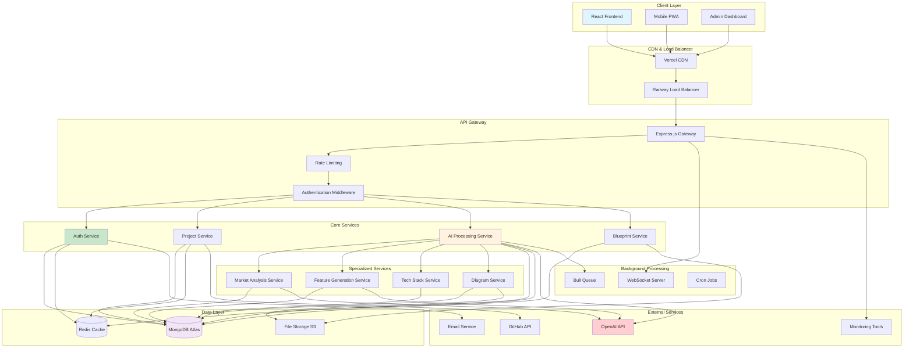
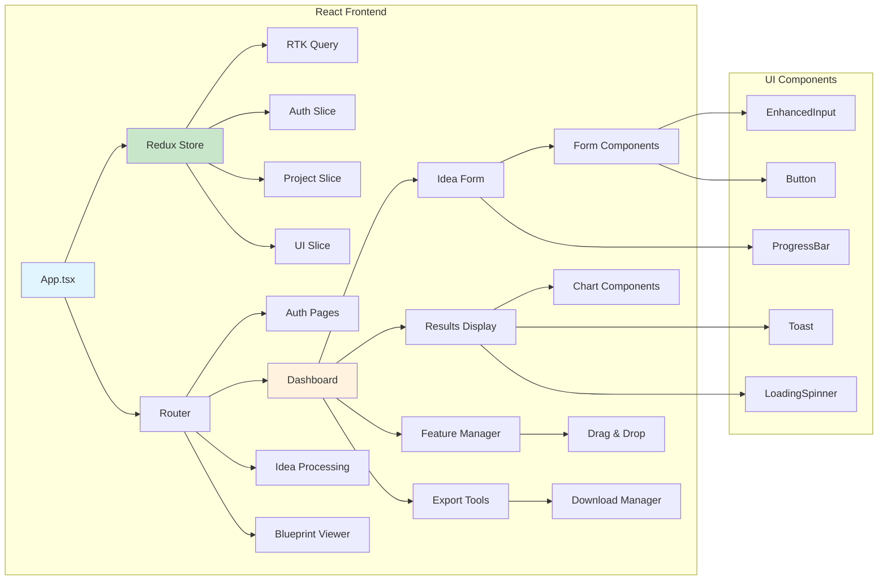
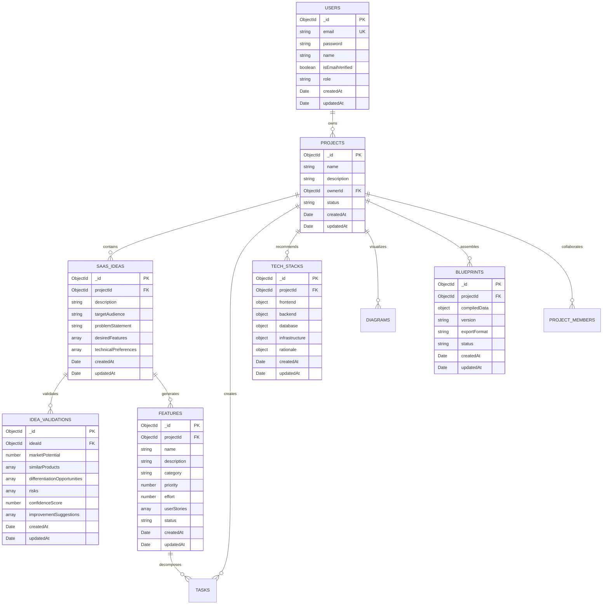
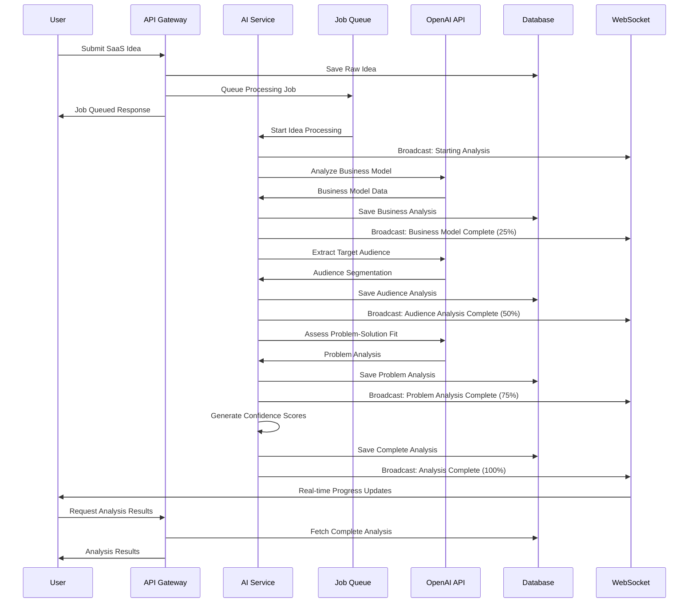
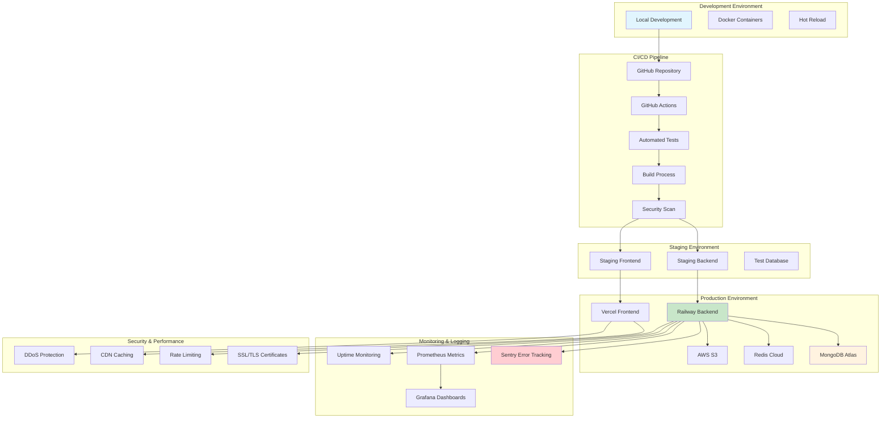

# SaaS Blueprint Generator - System Architecture Diagram

This diagram illustrates the complete technical architecture of our SaaS Blueprint Generator Platform, including microservices, databases, external integrations, and deployment infrastructure.

## High-Level System Architecture

## Detailed Service Architecture

### 1. Frontend Architecture

### 2. Backend Microservices Architecture

```mermaid
graph TB
    subgraph "Authentication Service"
        A1[User Registration]
        A2[JWT Token Management]
        A3[Password Security]
        A4[Email Verification]
        A5[Role-Based Access]
    end
    
    subgraph "Project Management Service"
        B1[Project CRUD]
        B2[Team Management]
        B3[Member Invitations]
        B4[Activity Logging]
        B5[Project Analytics]
    end
    
    subgraph "AI Processing Service"
        C1[Idea Analysis Engine]
        C2[OpenAI Integration]
        C3[Processing Queue]
        C4[Result Aggregation]
        C5[Confidence Scoring]
    end
    
    subgraph "Market Analysis Service"
        D1[Market Research]
        D2[Competitor Analysis]
        D3[Risk Assessment]
        D4[Trend Analysis]
        D5[Validation Scoring]
    end
    
    subgraph "Feature Generation Service"
        E1[Feature Extraction]
        E2[Priority Algorithms]
        E3[User Story Generation]
        E4[Effort Estimation]
        E5[Dependency Mapping]
    end
    
    subgraph "Blueprint Assembly Service"
        F1[Component Aggregation]
        F2[Template Engine]
        F3[Export Generation]
        F4[Version Control]
        F5[Sharing Management]
    end
    
    A1 --> A2
    A2 --> A3
    A3 --> A4
    A4 --> A5
    
    B1 --> B2
    B2 --> B3
    B3 --> B4
    B4 --> B5
    
    C1 --> C2
    C2 --> C3
    C3 --> C4
    C4 --> C5
    
    D1 --> D2
    D2 --> D3
    D3 --> D4
    D4 --> D5
    
    E1 --> E2
    E2 --> E3
    E3 --> E4
    E4 --> E5
    
    F1 --> F2
    F2 --> F3
    F3 --> F4
    F4 --> F5
    
    style C1 fill:#fff3e0
    style D1 fill:#e8f5e8
    style E1 fill:#f3e5f5
    style F1 fill:#e1f5fe
```

### 3. Database Design & Data Flow

### 4. AI Processing Pipeline

### 5. Deployment Architecture

## Infrastructure Details

### 🚀 Production Hosting
- **Frontend**: Vercel (React deployment with CDN)
- **Backend**: Railway (Node.js deployment with auto-scaling)
- **Database**: MongoDB Atlas (Free tier with 500MB storage)
- **Cache**: Redis Cloud (Free tier with 30MB)
- **Storage**: AWS S3 Compatible (for diagram exports)

### 🔒 Security Implementation
- **Authentication**: JWT tokens with refresh mechanism
- **Authorization**: Role-based access control (RBAC)
- **Data Protection**: Encryption at rest and in transit
- **API Security**: Rate limiting, CORS, input validation
- **Monitoring**: Real-time security event tracking

### 📊 Performance Optimization
- **Caching Strategy**: Redis for session data and frequent queries
- **CDN**: Global content delivery for static assets
- **Database Indexing**: Optimized MongoDB indexes
- **Code Splitting**: Lazy loading for React components
- **Image Optimization**: Automatic compression and format conversion

### 🔧 Development Tools
- **Version Control**: Git with GitHub
- **CI/CD**: GitHub Actions with automated testing
- **Code Quality**: ESLint, Prettier, TypeScript
- **Testing**: Jest, React Testing Library, Cypress
- **Documentation**: Auto-generated API docs with Swagger

## Scalability Considerations

### Horizontal Scaling
- **Microservices**: Independent service scaling
- **Load Balancing**: Automatic traffic distribution
- **Database Sharding**: Horizontal database partitioning
- **Queue Scaling**: Auto-scaling background job processing

### Performance Monitoring
- **Real-time Metrics**: Application performance monitoring
- **User Analytics**: Usage patterns and feature adoption
- **Error Tracking**: Comprehensive error monitoring and alerting
- **Cost Optimization**: Resource usage tracking and optimization

This architecture ensures a robust, scalable, and maintainable platform capable of handling thousands of users while maintaining excellent performance and reliability. 