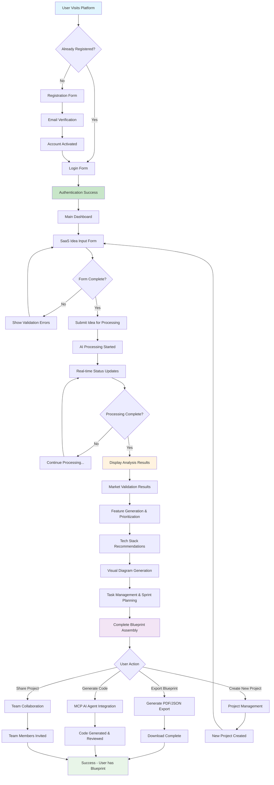
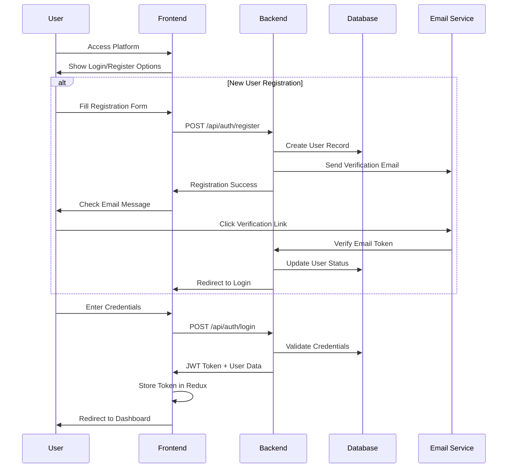
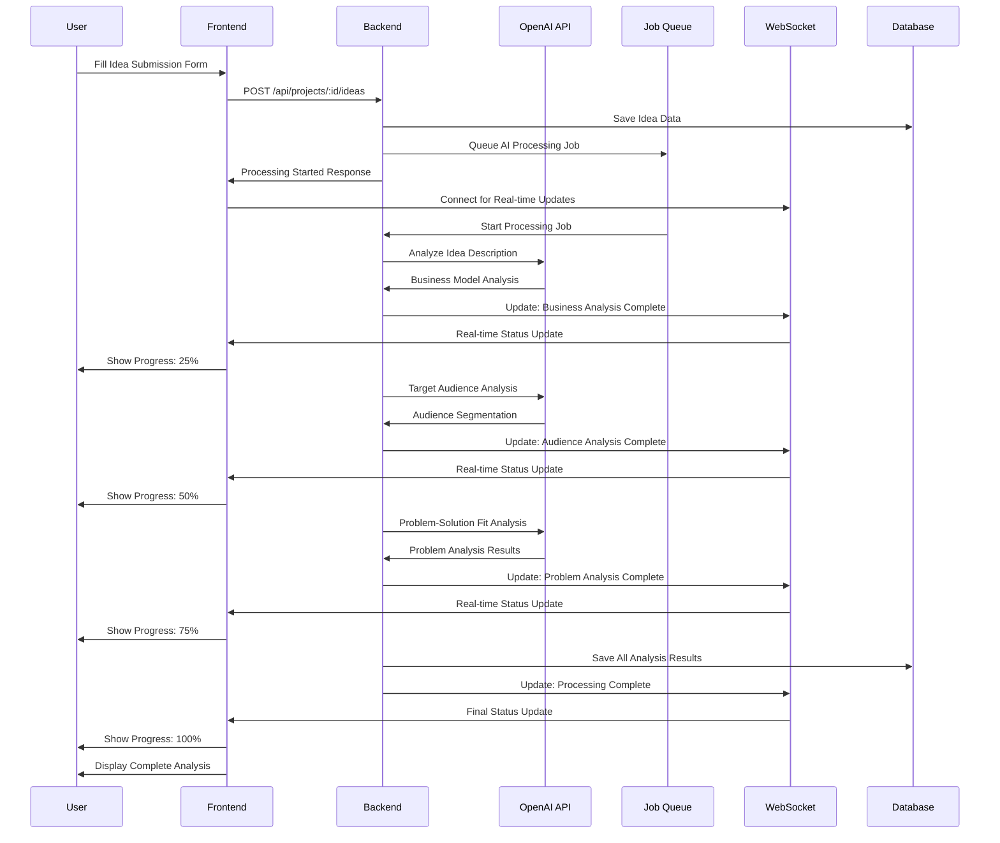
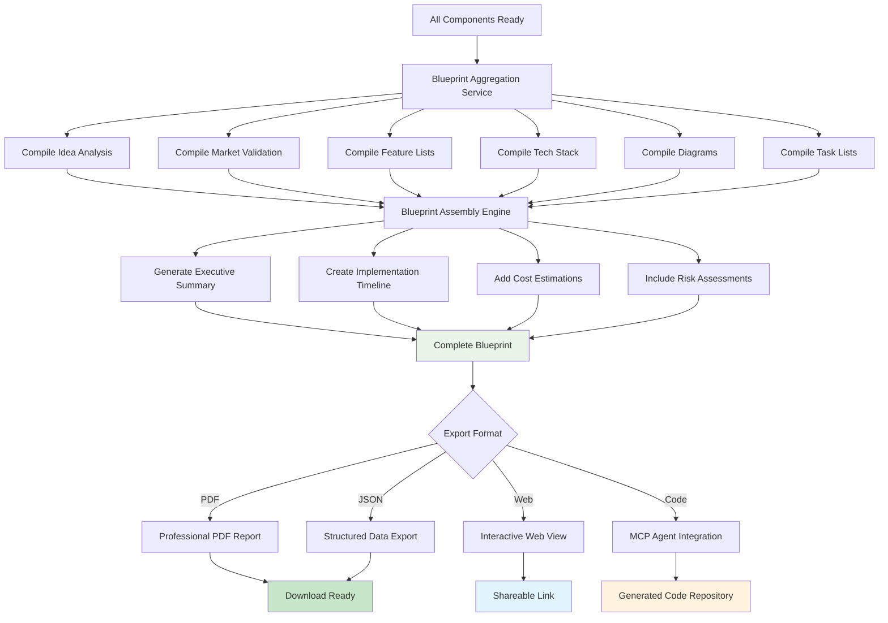

# SaaS Blueprint Generator - User Flow Diagram

This diagram illustrates the complete user journey through our SaaS Blueprint Generator Platform, from initial login to final blueprint generation and code export.

## User Flow Overview

## Detailed Process Flows

### 1. Authentication Flow

### 2. AI Idea Processing Flow

### 3. Feature Generation & Prioritization Flow

```mermaid
flowchart LR
    A[Validated Idea] --> B[AI Feature Extraction]
    B --> C[Feature Categorization]
    C --> D{Feature Type}
    
    D -->|MVP| E[Core Features]
    D -->|Growth| F[Enhancement Features]
    D -->|Delight| G[Future Features]
    
    E --> H[Priority Scoring]
    F --> H
    G --> H
    
    H --> I[Effort Estimation]
    I --> J[Value vs Effort Matrix]
    J --> K[User Story Generation]
    K --> L[Acceptance Criteria]
    L --> M[Feature Roadmap]
    
    M --> N{User Action}
    N -->|Customize| O[Edit Features]
    N -->|Approve| P[Generate Tasks]
    N -->|Export| Q[Feature Documentation]
    
    O --> H
    P --> R[Sprint Planning]
    Q --> S[PDF/JSON Export]
    
    style E fill:#c8e6c9
    style F fill:#fff3e0
    style G fill:#ffcdd2
    style M fill:#e1f5fe
```

### 4. Blueprint Generation & Export Flow

## Key User Experience Points

### 🎯 Critical Success Moments
1. **First 5 Minutes**: User submits idea and sees AI processing begin
2. **Processing Complete**: Comprehensive analysis results displayed
3. **Feature Discovery**: AI-generated features match user expectations
4. **Blueprint Export**: Professional documentation ready for implementation
5. **Code Generation**: Actual code produced from blueprint

### 🔄 Feedback Loops
- **Real-time Processing**: WebSocket updates keep users engaged
- **Iterative Refinement**: Users can edit and reprocess at any stage
- **Collaborative Review**: Team members can comment and suggest changes
- **Version Control**: Track changes and compare different blueprint versions

### 📱 Multi-Device Experience
- **Mobile Responsive**: Full functionality on mobile devices
- **Progressive Web App**: Offline capabilities for viewing blueprints
- **Cross-Platform**: Consistent experience across all devices

## Technical Implementation Notes

### Frontend Components
- `IdeaSubmissionForm`: Multi-step guided form with validation
- `ProcessingStatus`: Real-time progress with WebSocket integration
- `ResultsDashboard`: Comprehensive analysis display
- `BlueprintViewer`: Interactive blueprint navigation
- `ExportManager`: Multiple export format handling

### Backend Services
- `IdeaProcessor`: AI orchestration and analysis
- `BlueprintAssembler`: Component aggregation service
- `ExportService`: Multi-format export generation
- `WebSocketManager`: Real-time communication
- `MCPIntegration`: Code generation coordination

This user flow ensures a smooth, engaging experience that delivers immediate value while building comprehensive SaaS blueprints. 